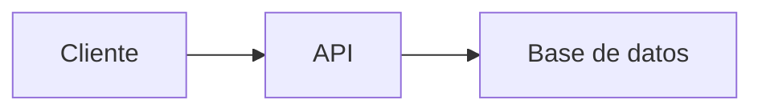

# 📚 Estudio de Roles Básicos en Desarrollo Web y Móvil

##  Recurso Usen el Link odicial para aprender git /github Todos 
https://docs.github.com/es/get-started/start-your-journey/git-and-github-learning-resources
## 0) Integrantes del equipo de estudio y sus responsabilidades en el repositorio *(actualizar)*

0. Justo Vilca Alessandro Josue ajustov@unsa.edu.pe
2. Jonnier Angel Condori Catasi   
3. María  
...  
12. 

## 1) Conceptos Generales para tener en cuenta
En el contexto de desarrollo web y móvil: diferencias entre librerías, frameworks y patrones de diseño.

## 2) Conociendo Git
Describiremos cómo nos sirve localmente para poder versionar nuestro software.

## 3) Conociendo Github  
- Describiendo el uso de repositorio remoto  
- Cómo definimos repositorio  
- Cómo configurar para permitir al equipo colaborar  
- Supervisión de posibles conflictos  

### Temas a desarrollar por los miembros del Equipo:  
**Roles básicos en el desarrollo de aplicaciones web y aplicación móvil**

## 4) Desarrollador Frontend
- Descripción del rol  
- Habilidades requeridas  
- Relación con roles de backend, QA, Desarrollador Android  
- Stack tecnológico:  
  - Lenguajes  
  - Frameworks  

## 5) Links recomendados para capacitación Rol Frontend

🔹 **Sin certificaciones**:  
🔹 **Con certificación**:  
🔹 **Proyectos completos de ejemplo**:  
🔹 **Recomendadas por líderes (Microsoft, AWS, Google)**:  

## 6) Desarrollador Backend
*(Estructura similar a Frontend)*

## 7) Links recomendados para capacitación Rol Backend

## 8) Rol QA
¿Qué es QA?
El Quality Assurance es un conjunto de procesos, técnicas y actividades diseñadas para verificar que un software o producto tecnológico cumpla con los requisitos establecidos, funcione correctamente y proporcione una buena experiencia al usuario. A diferencia del control de calidad (QC), que se centra en detectar defectos en el producto terminado, el QA se enfoca en prevenir defectos durante todo el ciclo de desarrollo.
El QA puede aplicarse a:
Software (aplicaciones web, móviles, de escritorio).
Sistemas embebidos.
Productos digitales en general.
Responsabilidades de un QA
Un profesional de QA (ingeniero o tester de QA) tiene varias responsabilidades, que incluyen:
Definición de estándares de calidad: Establecer criterios claros para determinar si el software es aceptable (funcionalidad, rendimiento, seguridad, etc.).
Planificación de pruebas: Diseñar planes de pruebas que cubran todos los aspectos del software, como pruebas funcionales, de rendimiento, de seguridad, de usabilidad, etc.
Ejecución de pruebas:
Pruebas manuales: Probar la aplicación interactuando con ella como lo haría un usuario.
Pruebas automatizadas: Escribir scripts para automatizar pruebas repetitivas.
Identificación y reporte de bugs: Documentar errores o fallos en herramientas como Jira, Trello o Bugzilla, proporcionando información detallada para que los desarrolladores los corrijan.
Colaboración con equipos: Trabajar con desarrolladores, gerentes de producto y diseñadores para alinear el producto con los requisitos del cliente.
Validación de requisitos: Asegurarse de que el software cumple con los requerimientos funcionales y no funcionales establecidos.
Pruebas de regresión: Verificar que las nuevas funcionalidades o correcciones no afecten negativamente las partes existentes del software.
Monitoreo continuo: En entornos ágiles, el QA puede participar en revisiones continuas durante el desarrollo.
Tipos de Pruebas en QA
El QA abarca diferentes tipos de pruebas, dependiendo del objetivo:
Pruebas funcionales:
Verifican que el software cumpla con las funcionalidades especificadas.
Ejemplo: Comprobar que un botón de "enviar" en un formulario funciona correctamente.
Pruebas no funcionales:
Evalúan aspectos como rendimiento, escalabilidad, seguridad y usabilidad.
Ejemplo: Medir el tiempo de carga de una página web.
Pruebas de regresión:
Aseguran que los cambios no rompan funcionalidades existentes.
Pruebas de integración:
Verifican que los diferentes módulos o componentes del software funcionen juntos.
Pruebas de carga y estrés:
Evalúan el comportamiento del sistema bajo alta demanda o condiciones extremas.
Pruebas de usabilidad:
Evalúan si la interfaz es intuitiva y fácil de usar.
Pruebas de seguridad:
Detectan vulnerabilidades, como inyecciones SQL o problemas de autenticación.
Pruebas de compatibilidad:
Aseguran que el software funcione en diferentes dispositivos, navegadores y sistemas operativos.
## 9) Links recomendados para capacitación Rol QA
- https://platzi.com/cursos/pruebas-software/
## 10) Desarrollador Android

## 11) Links recomendados para capacitación Rol Android

## 12) Pasos a Desarrollar  
1. **Integrante 0** crea repositorio remoto: `EstudioRolesBasicos`  
2. Compartir el repositorio con compañeros:  
   - Ir a Settings ⚙️ > Collaborators  
   - Invitar usando nombre de usuario GitHub o email registrado  
3. **Compañeros invitados**:  
   - Recibirán invitación por email  
   - Clonar repositorio:  
     ```bash
     cd practica
     git clone https://github.com/jjuarez29/EstudioRolesBasicos
     cd EstudioRolesBasicos
     ```
   - Ver contenido con `dir` (Windows) o `ls` (Linux/Mac)
ejemplo de link
https://github.com/jjuarez29/PYTHON01/settings

## Conociendo algo de mermaid y markdown
**Mermaid** y **Markdown** son herramientas complementarias pero con propósitos diferentes. Aquí te explico sus diferencias y similitudes:

---

### 🔹 **Markdown** (`.md`)
Es un **lenguaje de marcado ligero** para formatear texto plano de manera sencilla, que se convierte en HTML.

**Características**:
1. **Sintaxis simple**: Usa símbolos como `#`, `*`, `>` para títulos, listas, citas, etc.
   ```markdown
   # Título
   - Lista
   **negrita**
   ```
2. **Propósito principal**: Documentación legible en repositorios (como `README.md`).
3. **Soporte nativo en GitHub/GitLab**: Se renderiza automáticamente.
4. **No es programable**: Solo estructura texto e imágenes.

---

### 🔹 **Mermaid**
Es una **librería de diagramación** que permite crear gráficos mediante código dentro de documentos Markdown.

**Características**:
1. **Sintaxis específica**: Usa bloques de código con la etiqueta `mermaid`.
   ````markdown
   ```mermaid
   graph TD
     A[Inicio] --> B{Decisión}
     B -->|Sí| C[OK]
     B -->|No| D[Error]
   ```
   ````
2. **Propósito principal**: Generar diagramas (flujos, UML, Gantt, etc.) sin herramientas externas.
3. **Requiere soporte**: Funciona en GitHub/GitLab con renderizadores compatibles (no en todos lados).
4. **Es programable**: Permite lógica para estructurar gráficos.

---

### 🔄 **Similitudes**
1. **Ambos usan texto plano**: Son legibles sin renderizar.
2. **Se integran en `.md`**: Mermaid vive dentro de bloques de código en Markdown.
3. **Uso en documentación**: Ideales para repositorios y wikis.

---

### 📌 **Diferencias clave**
| Característica       | Markdown                          | Mermaid                          |
|----------------------|-----------------------------------|----------------------------------|
| **Función**          | Formatear texto                   | Crear diagramas                  |
| **Sintaxis**         | `# Título`, `- lista`             | `graph TD`, `pie chart`          |
| **Renderizado**      | Soporte universal                 | Requiere compatibilidad          |
| **Ejemplo**          | Hacer listas o tablas             | Hacer flujogramas o secuencias   |

---

### 🛠 **Ejemplo combinado (Markdown + Mermaid)**
````markdown
# Documentación del Proyecto

## 📊 Diagrama de flujo


## 📝 Pasos
1. Ejecutar `npm install`
2. Abrir `index.html`
````

---

### ✅ **¿Cuándo usar cada uno?**
- **Usa Markdown** para:  
  READMEs, documentación, wikis, notas simples.  
- **Usa Mermaid** para:  
  Diagramas técnicos, arquitectura, flujos de trabajo.  

**Nota**: GitHub soporta ambos, pero verifica si tu plataforma (como Slack o GitLab) también renderiza Mermaid.
