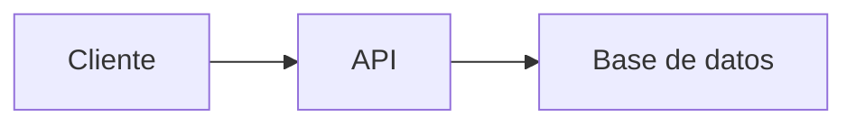

# 📚 Estudio de Roles Básicos en Desarrollo Web y Móvil

##  Recurso Usen el Link odicial para aprender git /github Todos 
https://docs.github.com/es/get-started/start-your-journey/git-and-github-learning-resources
## 0) Integrantes del equipo de estudio y sus responsabilidades en el repositorio *(actualizar)*

0. Justo Vilca Alessandro Josue ajustov@unsa.edu.pe
2. Jonnier Angel Condori Catasi   
3. José Carlos Valencia Vilcas jvalenciavi@unsa.edu.pe
4. Lerma Ccopa Jhonatan Javier
5. Sebastian Colen Bernal Neyra
...  
12. 

## 1) Conceptos Generales para tener en cuenta
En el contexto de desarrollo web y móvil: diferencias entre librerías, frameworks y patrones de diseño.

## 2) Conociendo Git
Describiremos cómo nos sirve localmente para poder versionar nuestro software.

## 3) Conociendo Github  
- Describiendo el uso de repositorio remoto  
- Cómo definimos repositorio  
- Cómo configurar para permitir al equipo colaborar  
- Supervisión de posibles conflictos  

### Temas a desarrollar por los miembros del Equipo:  
**Roles básicos en el desarrollo de aplicaciones web y aplicación móvil**

## 4) Desarrollador Frontend
- Descripción del rol
Un desarrollador frontend es un profesional encargado de crear la parte visual e interactiva de una aplicación web o móvil, es decir, todo lo que el usuario ve y con lo que interactúa directamente en el navegador. Su trabajo consiste en traducir los diseños proporcionados por diseñadores UI/UX en código funcional utilizando tecnologías como HTML, CSS y JavaScript, además de frameworks modernos como React, Angular o Vue.js.
- Habilidades requeridas
  
  Atención al detalle: pixel perfect en diseño.
  
  Pensamiento lógico y estructurado: para resolver problemas visuales y funcionales.
  
  Comunicación efectiva: con diseñadores, backend y otros stakeholders.
  
  Trabajo en equipo: colaborar en entornos ágiles.
  
  Adaptabilidad y aprendizaje continuo: nuevas herramientas, frameworks y mejores prácticas.
  
  Gestión del tiempo y organización: para cumplir plazos y manejar múltiples tareas.
  
- Relación con roles de backend, QA, Desarrollador Android
  
Backend Developer: Es quien desarrolla la lógica del servidor y las bases de datos. El frontend se comunica con el backend a través de APIs para obtener o enviar datos. Ambos deben coordinarse para que la información fluya correctamente y la aplicación funcione bien.

QA: Es quien prueba que la aplicación funcione sin errores. Trabaja con el frontend para asegurarse de que todo se vea y funcione como debe: botones, formularios, navegación, etc. También reporta fallos que el frontend debe corregir.

Desarrollador Android: Crea la versión móvil de la aplicación para Android. Aunque usa otras herramientas, su objetivo es similar al del frontend: que el usuario tenga una buena experiencia. Ambos deben mantener coherencia en el diseño y compartir datos desde el mismo backend.

- Stack tecnológico:  
  - Lenguajes
    
    HTML5: para estructurar el contenido de las páginas web.
    
    CSS3: para el diseño visual, estilos, colores, fuentes, etc.
    
    JavaScript (ES6+): para la interactividad, animaciones, validaciones, entre otras funciones dinámicas.
  - Frameworks  
    Frameworks/Librerías JavaScript:
    
        React.js: muy usado para construir interfaces interactivas con componentes reutilizables.
    
        Vue.js: fácil de aprender y muy flexible.
    
        Angular: más completo y estructurado, usado en proyectos grandes
    
    Frameworks de estilo (CSS):
        Bootstrap: facilita el diseño responsivo y componentes listos para usar.
    
        Tailwind CSS: ofrece clases utilitarias para construir diseños desde cero con más control.
    
        Sass o Less: preprocesadores CSS que permiten escribir estilos más organizados.
    
## 5) Links recomendados para capacitación Rol Frontend

🔹 **Sin certificaciones**: 
- https://developer.mozilla.org/es/
- https://www.w3schools.com/

🔹 **Con certificación**:
- https://www.w3schools.com/
- https://www.coursera.org/google-career-certificates
- https://www.udemy.com/  
🔹 **Proyectos completos de ejemplo**:  
🔹 **Recomendadas por líderes (Microsoft, AWS, Google)**:  

## 6) Desarrollador Backend
- El rol de Backend se encarga del desarrollo de la lógica del servidor, el manejo de datos, autenticación, seguridad y comunicación con bases de datos. Es responsable de que las funcionalidades de la aplicación   funcionen correctamente desde el lado oculto al usuario.
- Habilidades requeridas:
  - Manejo de lenguajes como JavaScript (Node.js), Python, Java, etc.
  - Uso de frameworks web (Express, Django, Spring, etc.)
  - Conexión y diseño de bases de datos (SQL y NoSQL)
  - Desarrollo y consumo de APIs (REST, GraphQL)
  - Control de versiones (Git)
  - Manejo de autenticación y seguridad
  - Pruebas y manejo de errores del servidor
- El Frontend se encarga de mostrar los datos que el Backend procesa y entrega.
- El QA también prueba las funcionalidades del Backend, especialmente la lógica de negocio, las respuestas del servidor y la integridad de los datos.
- Stack tecnológico:
  - Lenguajes:
    - JavaScript (Node.js)
      - Popular por su eficiencia y compatibilidad con el stack full JavaScript.
    - Python
      - Usado en servidores rápidos, APIs y machine learning.
    - Java
      - Robusto, usado en aplicaciones empresariales a gran escala.
    - PHP
      - Ampliamente usado en la web, especialmente con WordPress.
    - Go
      - Lenguaje moderno y rápido, ideal para microservicios y sistemas concurrentes.
- Frameworks:
  - Express.js (Node.js)
    - Minimalista y rápido, ideal para crear APIs RESTful en JavaScript.
  - Django (Python)
    - Framework completo con ORM, seguridad, y administración incluida.
  - Flask (Python)
    - Más ligero que Django, usado para APIs pequeñas o microservicios.
  - Spring Boot (Java).
    - Potente framework empresarial con fuerte soporte para bases de datos, seguridad y escalabilidad.
  - Laravel (PHP)
    - Framework moderno, sencillo y muy usado para desarrollar aplicaciones web robustas.

## 7) Links recomendados para capacitación Rol Backend
- Sin certificaciones
- https://www.pildorasinformaticas.es/course/php-mysql/
- Con certificaciones
- https://www.classcentral.com/course/freecodecamp-back-end-development-and-apis-34063
- https://www.udemy.com/course/curso-experto-en-backend/?utm_source=adwords&utm_medium=udemyads&utm_campaign=Search_DSA_Beta_Prof_la.ES_cc.ROW-Spanish&campaigntype=Search&portfolio=ROW-Spanish&language=ES&product=Course&test=&audience=DSA&topic=&priority=Beta&utm_content=deal4584&utm_term=_._ag_167955697431_._ad_706510832628_._kw__._de_c_._dm__._pl__._ti_dsa-2061826739417_._li_9186215_._pd__._&matchtype=&gad_source=1&gad_campaignid=21487757253&gbraid=0AAAAADROdO2nBYVVszGPLASy4nHJTqdC5&gclid=CjwKCAjwv5zEBhBwEiwAOg2YKDNFROfClEaPSL8mfFGZ1kQeNU0Aorhmg_OosukNWhgFJmD7RlboRhoC94oQAvD_BwE&couponCode=PMNVD3025
- https://cursa.app/es/curso-gratis/creando-api-usando-nodejs-bedh
- https://www.coursera.org/professional-certificates/meta-back-end-developer
- Recomendadas por líderes (Microsoft, AWS, Google)
- https://www.udemy.com/course/backend-servicios-web-y-servicios-windows-con-c-net/?utm_source=adwords&utm_medium=udemyads&utm_campaign=Search_DSA_Beta_Prof_la.ES_cc.ROW-Spanish&campaigntype=Search&portfolio=ROW-Spanish&language=ES&product=Course&test=&audience=DSA&topic=&priority=Beta&utm_content=deal4584&utm_term=_._ag_167955697871_._ad_706510832781_._kw__._de_c_._dm__._pl__._ti_dsa-2061826749537_._li_9186215_._pd__._&matchtype=&gad_source=1&gad_campaignid=21487757253&gbraid=0AAAAADROdO2nBYVVszGPLASy4nHJTqdC5&gclid=CjwKCAjwv5zEBhBwEiwAOg2YKA-BMmv1p-2hqHZHRcheT8wnBJNaYzABSuEB7NAlNu64QPgoInZZFxoCELMQAvD_BwE&couponCode=PMNVD3025

## 8) Rol QA
¿Qué es QA?
El Quality Assurance es un conjunto de procesos, técnicas y actividades diseñadas para verificar que un software o producto tecnológico cumpla con los requisitos establecidos, funcione correctamente y proporcione una buena experiencia al usuario. A diferencia del control de calidad (QC), que se centra en detectar defectos en el producto terminado, el QA se enfoca en prevenir defectos durante todo el ciclo de desarrollo.
El QA puede aplicarse a:
Software (aplicaciones web, móviles, de escritorio).
Sistemas embebidos.
Productos digitales en general.
Responsabilidades de un QA
Un profesional de QA (ingeniero o tester de QA) tiene varias responsabilidades, que incluyen:
Definición de estándares de calidad: Establecer criterios claros para determinar si el software es aceptable (funcionalidad, rendimiento, seguridad, etc.).
Planificación de pruebas: Diseñar planes de pruebas que cubran todos los aspectos del software, como pruebas funcionales, de rendimiento, de seguridad, de usabilidad, etc.
Ejecución de pruebas:
Pruebas manuales: Probar la aplicación interactuando con ella como lo haría un usuario.
Pruebas automatizadas: Escribir scripts para automatizar pruebas repetitivas.
Identificación y reporte de bugs: Documentar errores o fallos en herramientas como Jira, Trello o Bugzilla, proporcionando información detallada para que los desarrolladores los corrijan.
Colaboración con equipos: Trabajar con desarrolladores, gerentes de producto y diseñadores para alinear el producto con los requisitos del cliente.
Validación de requisitos: Asegurarse de que el software cumple con los requerimientos funcionales y no funcionales establecidos.
Pruebas de regresión: Verificar que las nuevas funcionalidades o correcciones no afecten negativamente las partes existentes del software.
Monitoreo continuo: En entornos ágiles, el QA puede participar en revisiones continuas durante el desarrollo.
Tipos de Pruebas en QA
El QA abarca diferentes tipos de pruebas, dependiendo del objetivo:
Pruebas funcionales:
Verifican que el software cumpla con las funcionalidades especificadas.
Ejemplo: Comprobar que un botón de "enviar" en un formulario funciona correctamente.
Pruebas no funcionales:
Evalúan aspectos como rendimiento, escalabilidad, seguridad y usabilidad.
Ejemplo: Medir el tiempo de carga de una página web.
Pruebas de regresión:
Aseguran que los cambios no rompan funcionalidades existentes.
Pruebas de integración:
Verifican que los diferentes módulos o componentes del software funcionen juntos.
Pruebas de carga y estrés:
Evalúan el comportamiento del sistema bajo alta demanda o condiciones extremas.
Pruebas de usabilidad:
Evalúan si la interfaz es intuitiva y fácil de usar.
Pruebas de seguridad:
Detectan vulnerabilidades, como inyecciones SQL o problemas de autenticación.
Pruebas de compatibilidad:
Aseguran que el software funcione en diferentes dispositivos, navegadores y sistemas operativos.

## Herramientas Utilizadas en QA
El stack tecnológico de un QA incluye herramientas para pruebas manuales, automatizadas y gestión de proyectos. Algunas de las más comunes son:
Herramientas de pruebas manuales:
TestRail: Para gestionar casos de prueba.
Jira: Para reportar y seguir bugs.
Trello o Asana: Para organizar tareas de QA.
Herramientas de pruebas qautomatizadas:
Selenium: Para automatizar pruebas en navegadores web.
Cypress: Framework moderno para pruebas de aplicaciones web.
Appium: Para pruebas automatizadas en aplicaciones móviles.
Postman: Para pruebas de APIs.
JUnit o TestNG: Para pruebas unitarias en Java.
Herramientas de pruebas de rendimiento:
JMeter: Para pruebas de carga y estrés.
LoadRunner: Para pruebas de rendimiento a gran escala.
Herramientas de gestión de código y CI/CD:
Git: Para control de versiones.
Jenkins o GitHub Actions: Para integrar pruebas automatizadas en pipelines de CI/CD.
Herramientas de monitoreo:
New Relic o Datadog: Para monitorear el rendimiento en producción.

## QA en un Stack Tecnológico 
El QA interactúa con el stack tecnológico en varios niveles:
Frontend: Prueban la interfaz de usuario (HTML, CSS, JavaScript) para asegurar que sea funcional y visualmente consistente. Por ejemplo, verifican que el diseño responsivo (CSS) funcione en diferentes dispositivos.
Backend: Prueban APIs, lógica del servidor y bases de datos para garantizar que los datos se procesen correctamente.
Integración: Aseguran que el frontend y el backend se comuniquen sin problemas.
Infraestructura: Evalúan el rendimiento y la escalabilidad en entornos como AWS o Docker.
Por ejemplo, en un stack MERN (MongoDB, Express.js, React, Node.js):
El QA probaría los componentes de React (que usan HTML y CSS) para verificar la interfaz.
Usaría Postman para probar las APIs de Express.js.
Comprobaría la integridad de los datos en MongoDB.
Realizaría pruebas de carga para asegurar que Node.js maneje múltiples usuarios.
Metodologías de Trabajo en QA
Tradicional (Cascada): Pruebas al final del desarrollo, estructurada y secuencial. Ideal para proyectos fijos, pero menos flexible.
Ágil: Pruebas continuas en sprints, colaborativa y adaptable. Perfecta para cambios frecuentes.
DevOps: Automatización en CI/CD, pruebas rápidas y monitoreo en producción. Alta eficiencia técnica.
Lean: Enfocada en valor, elimina desperdicios con pruebas rápidas y críticas. Menos estructurada.
Shift-Left: Pruebas desde el diseño para detectar errores temprano. Reduce costos iniciales.
Shift-Right: Monitoreo y pruebas en producción para calidad a largo plazo. Requiere infraestructura robusta.

## 9) Links recomendados para capacitación Rol QA
- https://platzi.com/cursos/pruebas-software/
- https://softwaretestingfundamentals.com/
- https://www.youtube.com/c/TheTestingAcademy
## 10) Desarrollador Android
¿Que es?
proceso de creación de aplicaciones para dispositivos que utilizan el sistema operativo móvil Android. Este proceso implica la programación, diseño, prueba y lanzamiento de aplicaciones utilizando herramientas y lenguajes específicos.
Tipos de aplicaciones android:
Aplicaciones Nativas:
Se desarrollan específicamente para una plataforma utilizando lenguajes y herramientas nativas . Ofrecen el mejor rendimiento y acceso completo al hardware del dispositivo, pero requieren desarrollo separado para cada plataforma (Android e iOS). 
Aplicaciones Híbridas:
Se construyen con tecnologías web (HTML, CSS, JavaScript) pero se ejecutan dentro de un contenedor nativo, permitiendo que se instalen en dispositivos móviles y se comporten como aplicaciones nativas. Son más rápidas y económicas de desarrollar, con código compartido entre plataformas, pero pueden tener menor rendimiento y acceso limitado a algunas funciones del dispositivo. 
Aplicaciones Web:
Son sitios web optimizados para dispositivos móviles, accesibles a través de un navegador web. No se instalan en el dispositivo y se ejecutan directamente en la web. Son multiplataforma y fáciles de actualizar, pero pueden tener problemas de rendimiento y acceso limitado a funciones del dispositivo. 

## 11) Links recomendados para capacitación Rol Android
-https://platzi.com/ruta/desarrollo-android/
-https://www.youtube.com/@NetNinja
## 12) Pasos a Desarrollar  
1. **Integrante 0** crea repositorio remoto: `EstudioRolesBasicos`  
2. Compartir el repositorio con compañeros:  
   - Ir a Settings ⚙️ > Collaborators  
   - Invitar usando nombre de usuario GitHub o email registrado  
3. **Compañeros invitados**:  
   - Recibirán invitación por email  
   - Clonar repositorio:  
     ```bash
     cd practica
     git clone https://github.com/jjuarez29/EstudioRolesBasicos
     cd EstudioRolesBasicos
     ```
   - Ver contenido con `dir` (Windows) o `ls` (Linux/Mac)
ejemplo de link
https://github.com/jjuarez29/PYTHON01/settings

## Conociendo algo de mermaid y markdown
**Mermaid** y **Markdown** son herramientas complementarias pero con propósitos diferentes. Aquí te explico sus diferencias y similitudes:

---

### 🔹 **Markdown** (`.md`)
Es un **lenguaje de marcado ligero** para formatear texto plano de manera sencilla, que se convierte en HTML.

**Características**:
1. **Sintaxis simple**: Usa símbolos como `#`, `*`, `>` para títulos, listas, citas, etc.
   ```markdown
   # Título
   - Lista
   **negrita**
   ```
2. **Propósito principal**: Documentación legible en repositorios (como `README.md`).
3. **Soporte nativo en GitHub/GitLab**: Se renderiza automáticamente.
4. **No es programable**: Solo estructura texto e imágenes.

---

### 🔹 **Mermaid**
Es una **librería de diagramación** que permite crear gráficos mediante código dentro de documentos Markdown.

**Características**:
1. **Sintaxis específica**: Usa bloques de código con la etiqueta `mermaid`.
   ````markdown
   ```mermaid
   graph TD
     A[Inicio] --> B{Decisión}
     B -->|Sí| C[OK]
     B -->|No| D[Error]
   ```
   ````
2. **Propósito principal**: Generar diagramas (flujos, UML, Gantt, etc.) sin herramientas externas.
3. **Requiere soporte**: Funciona en GitHub/GitLab con renderizadores compatibles (no en todos lados).
4. **Es programable**: Permite lógica para estructurar gráficos.

---

### 🔄 **Similitudes**
1. **Ambos usan texto plano**: Son legibles sin renderizar.
2. **Se integran en `.md`**: Mermaid vive dentro de bloques de código en Markdown.
3. **Uso en documentación**: Ideales para repositorios y wikis.

---

### 📌 **Diferencias clave**
| Característica       | Markdown                          | Mermaid                          |
|----------------------|-----------------------------------|----------------------------------|
| **Función**          | Formatear texto                   | Crear diagramas                  |
| **Sintaxis**         | `# Título`, `- lista`             | `graph TD`, `pie chart`          |
| **Renderizado**      | Soporte universal                 | Requiere compatibilidad          |
| **Ejemplo**          | Hacer listas o tablas             | Hacer flujogramas o secuencias   |

---

### 🛠 **Ejemplo combinado (Markdown + Mermaid)**
````markdown
# Documentación del Proyecto

## 📊 Diagrama de flujo


## 📝 Pasos
1. Ejecutar `npm install`
2. Abrir `index.html`
````

---

### ✅ **¿Cuándo usar cada uno?**
- **Usa Markdown** para:  
  READMEs, documentación, wikis, notas simples.  
- **Usa Mermaid** para:  
  Diagramas técnicos, arquitectura, flujos de trabajo.  

**Nota**: GitHub soporta ambos, pero verifica si tu plataforma (como Slack o GitLab) también renderiza Mermaid.
